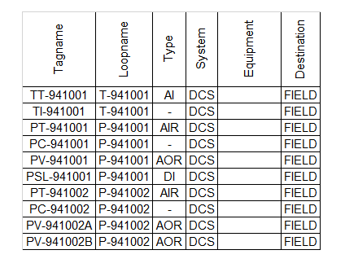
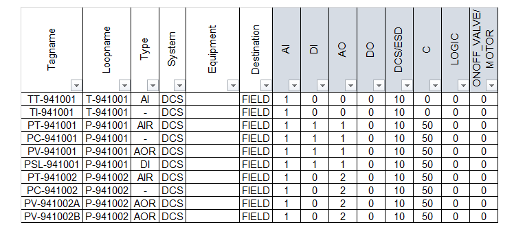
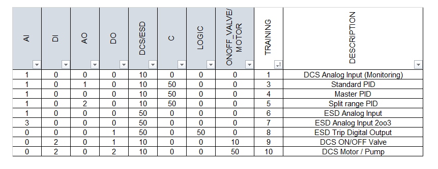
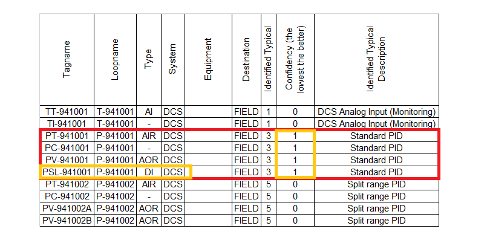
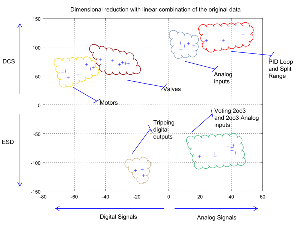

# Data Mining - KNN Classification

## Introduction

This example show how to classify the below datalist using the KNN algorithm and a metric model.

### The Datalist

The datalist is the database of the field instrument and the relevant properties, an extract is shown in the below picture.



Our target is the classification of the Loopname, a loop is a collection of instruments (identified by a Tagname), each Loop has a specific function that we will use to build the software and produce documentation (as the Loop Drawings).

### The Metric Model (aka Features)

A metric model is a representation of datalist as numerical set, a proper model is fundamental for good classification results.

In our case the metrics are:
- Number of AI, AO, DI, DO hardware signals into a loop
- Loop scope as Control/Monitoring, Logic, Motor/Valve
- System as DCS/ESD

Using Excel formulas the metric model cames automatically (see sw_loop_classification.xlsm for details) as in the below picture



### The Training Set

A training set is a collection of reference example represented with their metrics, this is used by the algorithm to classify the datalist.



The KNN algorithm verify the *distance* between the datalist and the nearest example in the training set, the result is a classification *with a confidence factor*.

### The KNN Algorithm

Is now just a matter to run the KNN in Matlab/Octave, following files applies:
- fastKNN.m
- data.m
- trained.m

Run the KNN as 1NN (*k* = 1), this because our data doesn't contain noise, larger *k* are used to overcome the noise in the classification. The *distance* as 2 means the use of Euclidean distance.

```
k=1;
distance=2;

[classified, dist] = KNNsearch(trained, data, k, distance)
```



The result is a **classification** and a **confidence** (is a distance, so a lower value gives a good confidence). 

In the above picture the algorithm has identified a *Standard PID* with non-zero confidence, so the matching is not full, this because that is a PID with an additional digital input Comparing that PID with the example in the training set will show the difference.

Using the confidence it can be retrieved if the training set shall be updated (and so even the software and documentation templates).

### How data looks like

Our model is in R^8^ but a dimensional reduction in R^2^ can give an overview and lets see what the algorithm sees.


